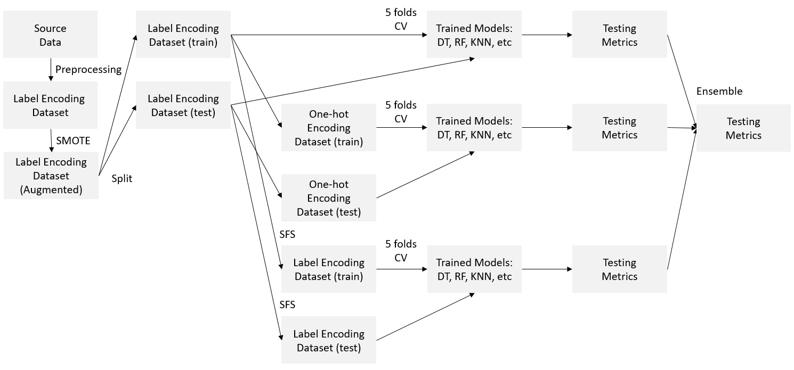
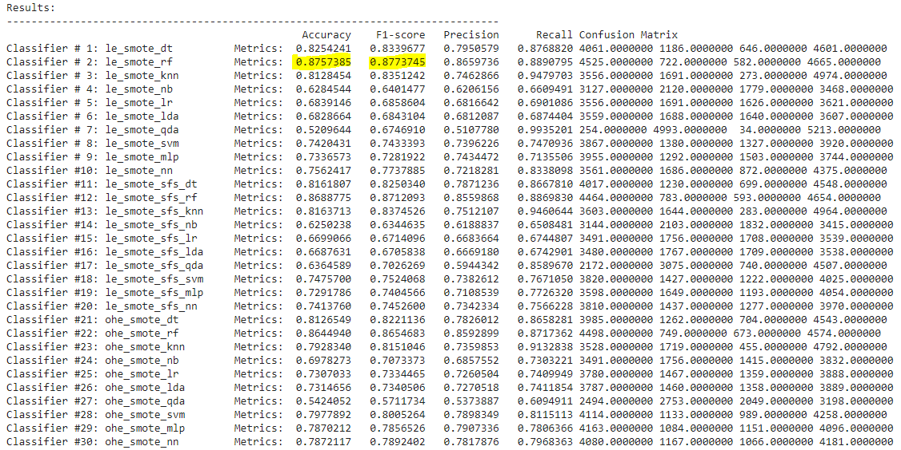
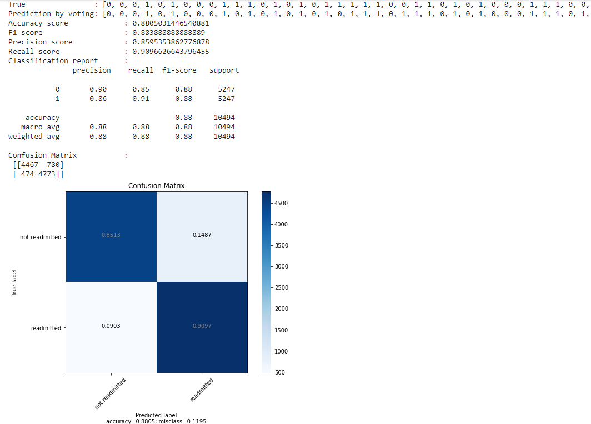
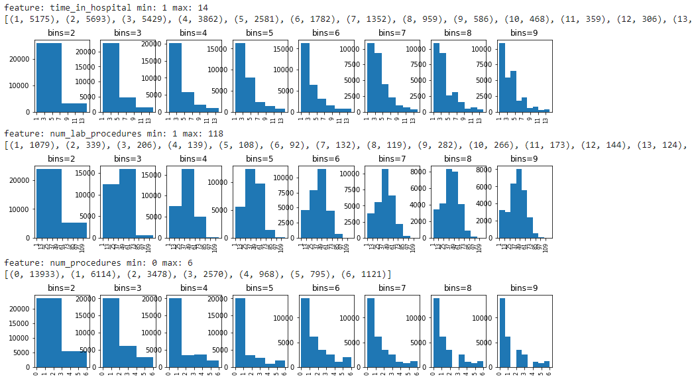
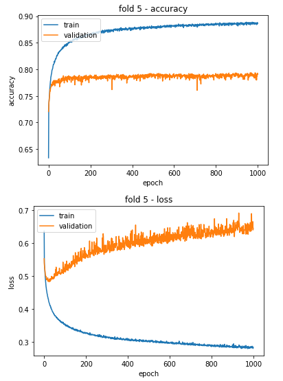

# Implementation of a Machine Learning Based Ensemble System for Predicting Readmission of Diabetic Patients after Hospital Discharge (v 1.0)


This is a repository for the project submission of Research Methodology Course. In this project, Machine Learning methods were applied to address the classification task of diabetic Patients Readmission after hospital discharge. The details of this project are given below.

## Table of Contents

1. [Manifest](#manifest)
2. [How to run the code](#How-to-run-the-code)
3. [Dataset](#Dataset)
4. [Major Methods](#Major-methods)
5. [System Overview](#System-Overview)
6. [Results](#Results)
7. [Functionality to Implement](#Functionality-to-Implement)
8. [Support](#Support)
9. [How to contribute](#How-to-contribute)
10. [Author](#Author)
11. [License](#License)
12. [Project Status](#Project-Status)

## Manifest

- File system structure of this project

```
- data --------------------------------------------> The dataset file
- img ---------------------------------------------> The images for README.md
- COMP5112_Research_Methodology_Project.ipynb -----> The code file
- README.md ---------------------------------------> This markdown file
```

## How to run the code
### Required Environment
[Colab](https://colab.research.google.com/) or [Jupyter Notebook](https://jupyter.org/)

### Procedure
1. Download the [COMP5112_Research_Methodology_Project.ipynb](https://github.com/PxpOnCa/research-methodology-github/blob/main/COMP5112_Research_Methodology_Project.ipynb)

2. Open the code file in Colab or Jupyter Notebook.

3. Run the "must run" cells in the following sequence (cell names): **Packages -> Methods to use**

4. Change the paths in the file accordingly, i.e.  all the <font color='red'>**/content/**</font> places should be updated. For example:
	
	```python
	dataset = pd.read_csv('/content/drive/MyDrive/Colab Notebooks/COMP5112_Research Methodology/diabetic_data.csv')
	```
	
5. Run the code in either way below:    
    **5.1 Run from scratch**     
    Run the cells from top to bottom one by one.  

    _Note: This will go through all the procedures of the implementation: Preparation -> Data Preprocessing -> Data Augmentation and One-hot encoding -> Label Encoded Data with SMOTE - Training and testing -> One-hot Encoded Data with SMOTE - Training and testing -> Feature Selection -> Label Encoded Data with SMOTE and SFS - Training and testing -> Ensemble for all classifiers_ 

    **5.2 Run from Specific cells**  
    To check the Data Preprocessing procedures, run from <font color='red'>**_Load Data_**</font> to <font color='red'>**_Save the label encoded dataset_**</font>.  
    To check the Data Augmentation and One-hot Encoding procedures, run from <font color='red'>**_Load the label encoded dataset_**</font> to <font color='red'>**_Label Encoded Data with SMOTE - Convert into One-hot Encoded Data_**</font>.  
    To check the Training and Testing procedures, run from <font color='red'>**_DT_**</font> to <font color='red'>**_NN_**</font>.  
    To check the Feature Selection procedures, run from <font color='red'>**_SFS-Forward_**</font> to <font color='red'>**_Save the Label Encoded Data with SMOTE by the selected feature columns_**</font>.  
    To check the Ensemble for all classifiers, run <font color='red'>**_Ensemble for all classifiers_**</font>.  

## Dataset
The dataset used in this project is a typical UCI dataset named [“Diabetes 130-US hospitals for years 1999-2008 Data Set”](https://archive.ics.uci.edu/ml/datasets/diabetes+130-us+hospitals+for+years+1999-2008). This dataset consists of 100,000 records for 70,000 diabetes patients and the records are collected from 130 US hospitals, each record of which includes 50 features representing an encounter. As the introduction on UCI says, a diabetes instance should meet the criteria below:  
1) It’s an inpatient encounter (a hospital admission);--
2) It’s a diabetic encounter, that is, one during which any kind of diabetes was entered to the system as a diagnosis;  
3) The length of stay was at least 1 day and at most 14 days;  
4) Laboratory tests were performed during the encounter;  
5) Medications were administered during the encounter. 

## Major Methods

- Continuous to Categorical : pd.cut()
- Dataset Encoding                : Label Encoding, One-hot Encoding
- Data Augmentation            : Synthetic Minority Over-samping Technique (SMOTE)
- Machine Learning               : Decision Tree (DT), Random Forest (RF), K Nearest Neighbor (KNN), Naïve Bayes (NB), Logistic Regression (LR), Linear Discriminant Analysis (LDA), Quadratic Discriminant Analysis (QDA), Support Vector Machine (SVM), Multiple Layer Perceptron (MLP), Neural Network (NN)  
- Feature Selection                : Sequential Forward Selection (SFS)

## System Overview
The block diagram of this system is shown below.




## Results

The Results of individual classifiers are shown below. Random Forest (RF) working on the Label Encoded dataset has the best performance. For detailed analysis, please refer to the project report.



The Results of Ensemble classifier is shown below, which outperformed any indiviual classifier. 



## Functionality to Implement
- Improve the method to convert continuous variables to categorical ones. For now, pd.cut() that assign continuous values to bins is used.The histogram distribution with different number of bins is observed to decide the bin edges. However, it is not optimized yet. A tutorial for this method can be found [here](https://www.absentdata.com/pandas/pandas-cut-continuous-to-categorical/).



- Implement categorical embedding to encode the categorical values. Deep learning technique can be applied with an embedding layer used to convert the categorical variables to vectors with specific dimensions. This encoding will encode original instances to a lower dimension than that of the one-hot encoding. Meanwhile, the weights of the embedding layer can be updated while training, which further improved the performance.

- Perform hyperparameters tuning for Machine Learning algorithms to find the best paramters and performances. Also, improve the network structure for MLP and NN. For example, as shown below, over-fitting is found during the training process.



- Apply Convolutional Neural Network to deal with tabular data. This technique is proposed by some literatures and the reported results are outstanding. However, due to limited time, it's not explored yet, which will be further tried out.

## Support

If there is any issue of the code or you want to communicate, please email me by [xapan@lakeheadu.ca](xapan@lakeheadu.ca)

## How to contribute
Please post your codes by GitHub pull request or email the codes to me by [xapan@lakeheadu.ca](xapan@lakeheadu.ca).

## Author
xapan

## License

This code can be downloaded and shared by anyone. It's not bound to any protocol.

## Project Status

This project will be updated monthly.


